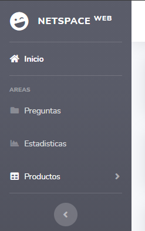

# Proyecto Lab 3 - NetSpace

En este proyecto usarmos los datos de la aplicacion NetSpace a la cual le daremos permisos cuando se haga el OAuth.

## Integrantes

Oliva Benjamin,
Asmuzi Gali,
Tello Eric.

### Estructura:
* La estructura de la plataforma comienza con el ingreso de usuario, que una vez logueado, pasara a un
dashboard de control e informacion del usuario, su cuenta, productos, ventas, etc.
* En este dashboard se pueden gestionar distintos parametros de la cuenta e informacion, y una vez terminado si lo desea puede desloquearse
con el boton "Salir".
* Representacion de la estructura de la Plataforma

* 

 ### Pasos para Ejecucion e ingreso a la Plataforma:
 
 * **1.** Ejecutar el archivo `main.go` para iniciar el servidor local en el puerto `:8080`, e iniciar el servicio de `Apache` y `MySQL` en XAMPP para usar la base de datos (Aclaracion: Se debe tener creada la Database `netspace` y la tabla `items` dentro de la misma para el correcto funcionamiento, ademas de la estructura misma de la tabla) .
 * **2.** Una vez que se este ejecutando el servidor local y XAMPP, iremos a: http://localhost:8080/ingresar .
 * **3.** Iniciaremos sesion en nuestra cuenta y daremos los permisos correspondientes a la aplicacion.
          (si usted ya esta logueado, se lo redijira directamente al dashboard)
 * **4.** Una vez hecha la autenticacion, se lo redirijira al dashboard donde en la parte superior izquierda estara su "nickname"
          de la plataforma, verificando asi que se haya logueado correctamente.

#### Funciones del DASHBOARD:

* **1.** Una vez en el dashboard podemos acceder a los links habilitados en la barra lateral izquierda como se ve en la siguiente imagen.
* 
* **2.** El apartado de Preguntas no redijira a una seccion donde se mostraran las preguntas realizadas en los items del usuario actualmente logueado
  junto con un boton correspondiente a la pregunta para ser respondida dentro de la plataforma, seguido de un mensaje de confirmacion de envio de respuesta.
* **3.** En el Apartado de Estadisticas, veremos valores correspondientes a los datos guardados por el usuario en la base de datos.
        Esto varia segun el usuario logueado y la informacion guardada por el mismo.
* **4.**  Y por ultimo tenemos el apartado Productos que consta de 3 secciones.
* **4. 1.**  La primera es de publicaciones donde el usuario puede ver los items
publicados por el mismo, junto con un boton de guardado para almacenar en la base de datos.
* **4. 2.** La segunda seccion es para Crear una Publicacion en MercadoLibre desde la plataforma NetSpace. 
            Se despliega un formulario en la pantalla para completar los datos del itema a publicar, y una vez completado se publica mostranso posteriormente un mensaje
            de confirmacion.
* **4. 3.** Por ultimo, esta la seccion de Ventas donde el usuario puede acceder a ver las Ventas recibidas en su cuenta, ademas de los datos correspondientes a cada venta en particular.

 

